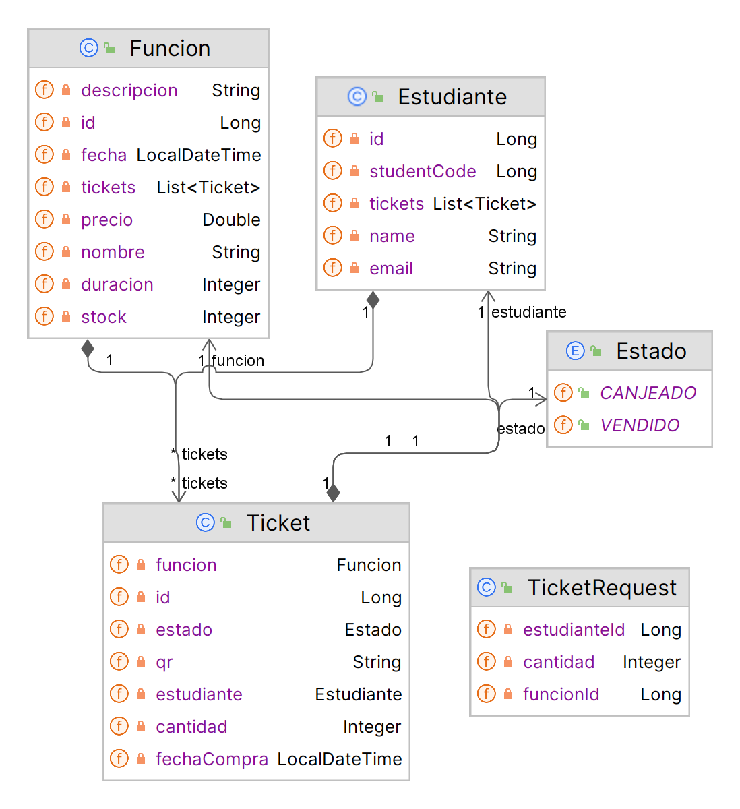
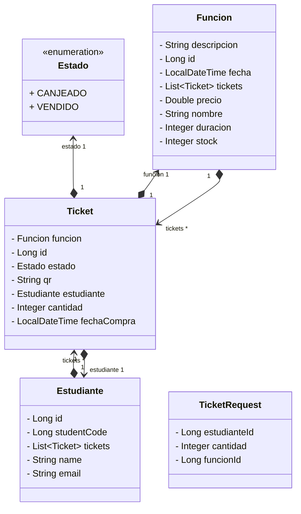

# Hackathon: Sistema de Venta de Entradas para Cine 🎥

## Contexto  
Los cines son esos lugares mágicos que guardan grandes recuerdos, desde la emoción de ver nuestra película favorita por primera vez 🍿, disfrutar de clásicos o compartir momentos con familia y amigos 🎬. En UTEC, también disfrutamos de noches de cine gracias a las organizaciones estudiantiles 🏫.

## Desafío  
Tu misión será diseñar un sistema de venta de entradas que permita a estas organizaciones gestionar eventos de cine de manera eficiente 📋. El sistema deberá permitir organizar y monitorear la recaudación de fondos y manejar los accesos de manera correcta 🔑.

## Postman Collection

La colección de Postman con los endpoints necesarios para la implementación de este sistema se encuentra en el siguiente enlace: [Postman Collection](https://app.getpostman.com/join-team?invite_code=543883cf7d52bdf731c6d3da16f98ce1&target_code=f7e73e8b8ffcd69ffe69e8b1427e2113) 📦. Para ello tendrán que hacer un fork de las colecciones para poder testear con facilidad sus endpoints y no perder tiempo en configuraciones.

## Calificando

Dentro de la colección de Postman encontrarán un flujo llamado `Hackathon 1 - Calificación`. Este verifica el flujo de toda la API y verifica que todo esté funcionando correctamente. 

Se revisará que lleguen los correos electrónicos con los códigos QR, que se pueda validar la entrada y que se calcule correctamente la recaudación de fondos.

## Requerimientos Específicos

1. **Entidades del Sistema:**
   - Estudiante 👤 (nombre, email, código de estudiante)
   - Función 📽️ (nombre, descripción, fecha, duración, precio, stock)
   - Ticket 🎟️ (id, QR, estado, estudiante, función, fecha de compra, cantidad de entradas)

2. **Funcionalidad de Tickets:**
   - Cada compra de entrada debe generar un ticket que incluya un QR como identificador único. Este QR se enviará al correo del usuario junto con un correo de plantilla 📧.
   - El sistema deberá cambiar el estado del ticket a "canjeado" una vez que se escanee la entrada ✔️ y enviar un correo de confirmación al usuario.

3. **Integración con API Externa:**
   - Utilizar la API de QR Code de [goQR.me](https://goqr.me/api/) para generar los códigos QR que se incluirán en los correos electrónicos de los tickets 🔗.

4. **Validación de Entradas:**
   - Implementar un endpoint que permita validar la autenticidad de un ticket escaneando el código QR. Si el ticket es válido, se deberá cambiar el estado del ticket a "canjeado" y enviar un correo de confirmación al usuario 📧. 

5. **Recaudación de Fondos:**
   - Implementar un endpoint que permita calcular la recaudación total de un evento en base a la cantidad de entradas vendidas y el precio de cada entrada 💰.

## Endpoints

### Estudiante API Endpoints

| Método | Endpoint                       | Descripción                        |
|--------|--------------------------------|------------------------------------|
| POST   | `/estudiante`                  | Crea un nuevo estudiante           |
| GET    | `/estudiante/{{estudianteId}}` | Obtiene un estudiante por su ID    |
| PUT    | `/estudiante/{{estudianteId}}` | Actualiza un estudiante por su ID  |
| PATCH  | `/estudiante/{{estudianteId}}` | Actualización parcial de un estudiante por su ID |
| DELETE | `/estudiante/{{estudianteId}}` | Elimina un estudiante por su ID    |

### Función API Endpoints

| Método | Endpoint                                 | Descripción                            |
|--------|------------------------------------------|----------------------------------------|
| POST   | `/funcion`                               | Crea una nueva función de cine         |
| GET    | `/funcion/{{funcionId}}`                 | Obtiene una función por su ID          |
| PUT    | `/funcion/{{funcionId}}`                 | Actualiza una función por su ID        |
| PATCH  | `/funcion/{{funcionId}}`                 | Actualización parcial de una función por su ID |
| DELETE | `/funcion/{{funcionId}}`                 | Elimina una función por su ID          |
| GET    | `/funcion/{{funcionId}}/earnings`        | Obtiene los ingresos generados por una función |

### Ticket API Endpoints

| Método | Endpoint                                          | Descripción                                    |
|--------|---------------------------------------------------|------------------------------------------------|
| POST   | `/tickets`                                        | Crea un nuevo ticket                           |
| GET    | `/tickets/{{ticketId}}`                           | Obtiene un ticket por su ID                    |
| PATCH  | `/tickets/{{ticketId}}/changeState`               | Cambia el estado de un ticket                  |
| DELETE | `/tickets/{{ticketId}}`                           | Elimina un ticket por su ID                    |
| GET    | `/tickets/estudiante/{{estudianteId}}`            | Obtiene todos los tickets de un estudiante ID  |
| GET    | `/tickets`                                        | Obtiene todos los tickets                      |

## Diagrama de Clases

Para visualizar el diagrama de clases desde la web de GitHub, puedes seguir este enlace:





## Plantilla de Correo Electrónico

El correo electrónico que se enviará a los estudiantes deberá tener la siguiente plantilla html:

```
<!DOCTYPE html>
<html>
<head>
  <title>¡Gracias por tu compra!</title>
</head>
<body>
  <h1>¡Gracias por tu compra!</h1>
  <p>¡Hola {{nombre}}! Te informamos que tu compra ha sido exitosa. A continuación, te presentamos los detalles de tu compra:</p>
  <ul>
    <li>Nombre de la película: {{nombrePelicula}}</li>
    <li>Fecha de la función: {{fechaFuncion}}</li>
    <li>Cantidad de entradas: {{cantidadEntradas}}</li>
    <li>Precio total: {{precioTotal}}</li>
    <li>Código QR: </li>
  </ul>
  <p>¡No olvides llevar tu código QR impreso o en tu dispositivo móvil para poder ingresar a la función! ¡Te esperamos!</p>
</body>
</html>
```

Deben reemplazar `{{nombre}}`, `{{nombrePelicula}}`, `{{fechaFuncion}}`, `{{cantidadEntradas}}`, `{{precioTotal}}` y `{{qr}}` con los datos correspondientes. Darle diseño a la plantilla es obligatorio. 

Denle su toque personal y hagan que la experiencia del usuario sea la mejor posible. 🎨
